  <picture>
    <source media="(prefers-color-scheme: dark)" srcset="./assets/svg/hero.svg">
    
  </picture>

  

## ✦ Current Focus

Currently architecting the MVP for **BuildBridge**, a scalable workforce infrastructure platform, while exploring **Agentic AI workflows** and **Distributed Systems**. I enjoy designing robust, production-ready systems that solve real engineering problems rather than following textbook tutorials.

  

## ✦ Featured Projects

<h3><a href="https://github.com/marvelpokemaster/NullTrace" style="text-decoration: none; color: inherit;">NullTrace</a></h3>

AI-powered Opinion & Feedback Analytics Platform. Engineered with JWT authentication, role-based access control, and granular feedback analytics within a containerized Azure deployment.

<code>Flask</code> • <code>Next.js</code> • <code>PostgreSQL</code> • <code>Docker</code> • <code>Azure</code>

 

<h3><a href="https://github.com/marvelpokemaster/BuildBridge" style="text-decoration: none; color: inherit;">BuildBridge</a></h3>

Workforce Infrastructure Platform connecting contractors and workers seamlessly. Architected as a high-performance startup MVP with robust authentication and state management.

<code>React</code> • <code>Node.js</code> • <code>Supabase</code> • <code>Vercel</code>

 

<h3><a href="https://github.com/marvelpokemaster/ReconX" style="text-decoration: none; color: inherit;">ReconX</a></h3>

OSINT & Internet Asset Intelligence Platform providing domain intelligence, DNS record enumeration, certificate discovery, and comprehensive infrastructure mapping.

<code>Python</code> • <code>FastAPI</code> • <code>React</code>

 

<h3><a href="https://github.com/marvelpokemaster/Agentic-Marketing" style="text-decoration: none; color: inherit;">Agentic Marketing</a></h3>

AI-powered Marketing Automation utilizing autonomous lead discovery, orchestrated LLM workflows, and intelligent campaign execution.

<code>Gemini API</code> • <code>PyTorch</code> • <code>Transformers</code>

 

  

## ✦ Technical Arsenal

- **Languages:** Python, TypeScript, JavaScript, Java, C, SQL
- **Frontend:** React, Next.js, TailwindCSS
- **Backend & Database:** Node.js, Flask, FastAPI, PostgreSQL, Supabase
- **Infrastructure & DevOps:** Docker, Azure, Vercel, Linux, Git
- **AI & ML:** PyTorch, Transformers, Gemini API

  

## ✦ GitHub Telemetry

  <picture>
    <source media="(prefers-color-scheme: dark)" srcset="https://github-readme-stats.vercel.app/api?username=marvelpokemaster&show_icons=true&theme=transparent&title_color=ffffff&text_color=8b949e&icon_color=58a6ff&bg_color=0d1117&hide_border=true&hide_title=true">
    
  </picture>
  <picture>
    <source media="(prefers-color-scheme: dark)" srcset="https://github-readme-stats.vercel.app/api/top-langs/?username=marvelpokemaster&layout=compact&theme=transparent&title_color=ffffff&text_color=8b949e&icon_color=a371f7&bg_color=0d1117&hide_border=true&hide_title=true">
    
  </picture>

  

## ✦ Engineering Philosophy

Code is a liability; architecture is an asset. I strive to design systems that are minimal, scalable, and inherently resilient. Rather than piecing together quick fixes, I deeply value rigorous engineering standards and well-considered system design, ensuring that what I build today remains maintainable tomorrow.

 

  <a href="mailto:adarsh.binu@outlook.com"><code>Contact</code></a> &nbsp; • &nbsp;
  <a href="https://linkedin.com/in/adarshbinu"><code>LinkedIn</code></a> &nbsp; • &nbsp;
  <a href="https://github.com/marvelpokemaster"><code>GitHub</code></a>

